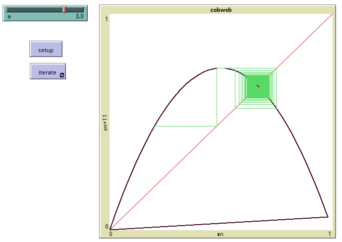

# Complejidad

Experimentos computacionales de Ciencia de la Complejidad

## Puntos fijos

Este modelo muestra cómo reiterando la regla de recurrencia sobre
valores previos da lugar a tres tipos de conducta. Acá está
el [modelo en NetLogo](punto_fijo.nlogo), se ve algo así:
 

 
## Diagrama de Telaraña

El mismo modelo pero ploteado en su espacio de fase.

Crear la telaraña es fácil con plotxy en NetLogo, [acá está el fuente](cobweb.nlogo).
