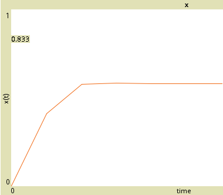
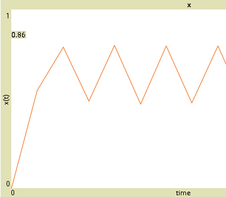
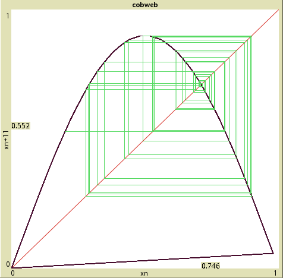
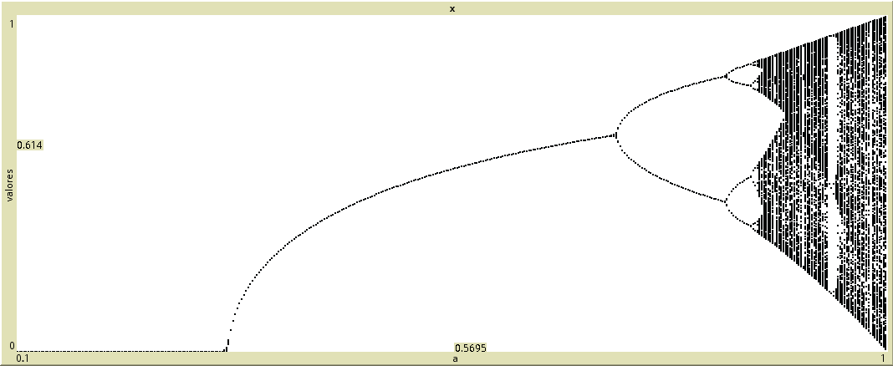

## Función Trascendental

Acá usamos el mapeo

    x[n+1] = a * sin(pi * x[n])

para generar la serie de tiempo, el diagrama de telaraña y el diagrama de bifurcaciones.

Estos son los programas en NetLogo:

 - [serie de tiempo](trascendental.nlogo)
 - [diagrama de telaraña](trascendental_cobweb.nlogo)
 - [diagrama de bifurcaciones](trascendental_bif.nlogo)

## Atractor a un punto fijo

## Atractor oscilatorio

## Régimen caótico

## Bifurcaciones

