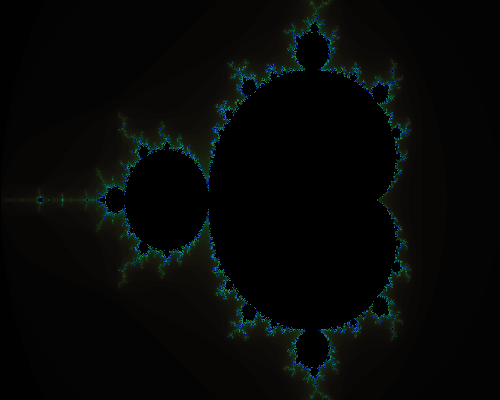
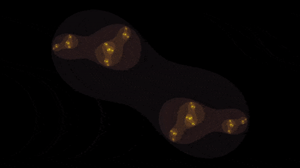

# Fractales

Acá tenemos una implementación en NetLogo y otra en Python del fractal de Mandelbrot.

En [mandelbrot.py](mandelbrot.py) también hay una implementación del Julia Set.

Sólo hay interfaz programática, o sea, para alterar los fractales hay
que editar el código. Al principio del script se configura la paleta
de color, al final se invoca la creación de mandelbrot o de julia.

Como ejemplo está comentado el código con el que generé esta animación:

## Cómo correr la versión de Python

Recomiendo el uso de un [ambiente virtual](http://virtualenv.org).

	$ virtualenv venv
	[...] # se instala el ambiente
	$ source venv/bin/activate
	(venv) $  # ambiente activado
	(venv) $ pip install -r requirements.txt
	[...] # se instalan las bibliotecas
	(venv) $ python mandelbrot.py
